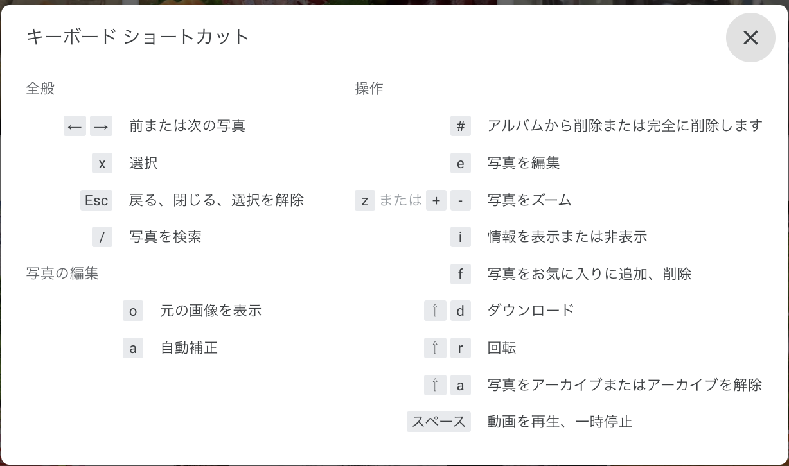

# Nizika - Google Photos Delete Tool (Puppeteer Headless)


# 概要

Googleフォトの画像を自動的に削除(ゴミ箱に格納)するツールです。Googleフォトのストレージを0Gにすることを目的に開発しています。Googleフォトは仕様としてゴミ箱に入れた時点でストレージの使用量はその分削減されます。
ChromeのヘッドレスブラウザツールであるPuppeteerで動作するため画面のないサーバー等でも動作させることが可能です。
動作確認のためブラウザを表示させての動作も可能です。

## 性能
- 50枚の画像を削除するのに77秒
- 100枚の画像を削除するのに154秒
- 500枚の画像を削除するのに13分(781秒)

# 動作準備

## 必要なソフトウェア

1. Chromeのインストール
2. Chrome拡張の[EditThisCookie](https://chrome.google.com/webstore/detail/editthiscookie/fngmhnnpilhplaeedifhccceomclgfbg?hl=ja)のインストール
3. Node.js

## インストール

```
npm install
```

## GoogleログインのためのCookieの準備

Google及びGooglePhotosログイン状態を再現するためにcookieが必要になります。EditThisCookieというChrome拡張を使用してCookie情報をファイルにコピーしてください。
ファイル名は任意です。


```
touch google.cookie
vi google.cookie

[
{
    "domain": ".google.com",
    "expirationDate": ~~~~,
```

# 実行

## スタンダード (100枚削除)

```
node nizika.js -c google.cookie
```

-cオプションは必須となります。-cオプション引数にcookieファイルを指定してください。

### 実行結果

```
{
  loop: 10,
  not: false,
  select: 10,
  url: 'https://photos.google.com/',
  cokkie: 'google.cookie',
  wait: 25
}
successCount:001 45s 2022/11/17 01:23:48
~
```

デフォルトの動作では10枚削除(select)を10回(loop)繰り返します。つまり10*10=100枚の削除を行います。


## 画像を50枚選択して削除 x 10回ループ (500枚削除)

```
node nizika.js -c google.cookie -s 50
```

```
successCount:001 78s 2022/11/17 01:23:48
successCount:002 77s 2022/11/17 01:25:06
~
successCount:010 77s 2022/11/17 01:35:29
13min (781s)
```

画像の選択に関しては50枚を上限に考えておいたほうがよいです。それ以上画像選択するとGooglePhot側のページの処理が重くなり意図しない動作になります。


## 画像を50枚選択して削除 x 20回ループ (1000枚削除)

```
node nizika.js -c google.cookie -s 50 -l 20
```

大量の画像を削除したい場合-lオプションの値を999などにします。ただし1プロセスでの処理を続けることになるためブラウザのメモリを食いつぶすことにもなるため推奨しません。永続的に画像を削除し続ける場合はシェルでプロセスを実行し続けるようにします。後述


## 画像を永遠に削除し続ける (推奨実行方法)

unix系シェルの場合になります

```
while true; do node nizika.js -c google.cookie -s 50; done
```

サーバーで実行させるときや、寝る前に自宅PCで動作させる時などを想定しています。
この場合のnizikaのプログラムの処理は下記のようになります。

1. 50枚の画像を選択し削除する
2. [1.]を10回繰り返す (500枚削除)
3. プロセスを終了する(ブラウザを閉じる)
4. プロセスを立ち上げて[1.]から繰り返す


## ヘッドレスをOFFにする（ブラウザを表示させながら動作)

```
node nizika.js -c google.cookie -n
```


# HELP

```
Usage: deleteGooglePhotoPupp [options]

Delete GooglePhoto tool. for puppeteer

Options:
  -c, --cokkie <file>  (must) cookie file path (json) [.google.com and photos.google.com]
  -l, --loop <num>     delete loop num (default: 10)
  -n, --not            not headless option (default: false)
  -s, --select <num>   delete select file num (default: 10)
  -w, --wait <sec>     wait init page load time (default: 25)
  -u, --url <url>      google photos url eg. https://photos.google.com/u/1/ (default: "https://photos.google.com/")
  -h, --help           display help for command
```

# 仕様詳細

### メイン処理にCSSセレクタを使用していません

プログラムの処理としてCSSセレクタを使用していません。そのため描写のwaitに関してはすべて時間指定で行っています。また画像の選択、削除に関してはGoogleフォトのキーボードショートカットを使用しています。そのためGoogleフォトのHTML仕様が変更されても動作には影響をうけません。




### 画像がなくなったことを検知する処理はありません

nizikaでは現行の仕様でGoogleフォトの画像がなくなったことを検知する処理がないため、画像がある程度少なくなったら目視で削除することを推奨します。

# Tips

## Macで動作させるとき

ディスプレイをOFFにする機能を無効化する必要があります。ディスプレイをOFFにすると省電力モードになりネットワーク系の動作も機能しなくなります。スクリンセーバーを起動しつつ寝る前にMacブックで動作させるのを推奨します。

## Googleアカウントの切り替え

# GooglePhotsの仕様

## 根源的問題として一括削除がブラウザからできない

Googleドライブと違い、すべての画像を一括で削除できない仕様になっています。そのためnizikaの様なツールが必要になります。

## ゴミ箱の仕様

Google Photsは画像をゴミ箱に入れた時点でGoogleOneのストレージ容量から削除されます。その点がGmailとGoogleドライブとは異なります。

## 一部の画像を削除してもGoogleOneの使用量が減らない問題

アプリのGoogleフォトで同期されたファイルの一部はGoogleフォトのストレージ容量に加算されない仕様になっています。そのためファイルを削除してもGoogleフォトの容量が減らないことがあります。該当するのは画像の(i)インフォボタンを押して下記のような情報が出る画像です。


